Design a map art with R and OpenStreetMap
================
Evgeny Politov
September 9, 2023

I bet you have seen tons of beautiful (well, not always) Map art on the
web If not, I’ve got you covered:

<figure>

<figcaption aria-hidden="true">credit: <a
href="https://www.mapshop.com/"
class="uri">https://www.mapshop.com/</a></figcaption>
</figure>

Looks cool, right? However after finding more and more sites offering
similarly looking maps I was not inclined to spend my money on any of
them. This gave me an idea: even though those maps may bear low artistic
merit they could still be a great source of learning. So, equipped with
basic R skills, some experience with vector graphics and faint memories
of what longitude and latitude are, I approached this project.

## Where should I start

After a short research I figured out that there are plenty of R
libraries, capable of pulling, processing and plotting GIS data, so not
to get lost completely
(<a href="https://cran.r-project.org/web/views/Spatial.html"
target="_blank">try not to yourself</a>) I decided to develop a set of
requirements for the final output to narrow down my choices.

Here are my expectations - **High Resolution, print-ready, minimalist
map of my hometown (Volgograd, Russia)**.

Now translation:

**High Resolution** - if I learned anything working for 2 years in
Printing services is that to get a high-quality prints you don’t want to
mess with any raster, you need a vector image, this way you will be able
to modify and scale it to any size without quality loss.

**Print ready** - map should be fully completed in R without use of
other graphic editing software like Photoshop. This is more of a
self-inclined limitation to see how far R could take me.

**Volgograd** is far from US, meaning US Census GIS data won’t help me
much.

**Minimalist Map** - should not include too many detail, I will shoot to
have 3 layers / features, like roads, parks and water.

That way I ended up with 4 libraries:

``` r
library(osmdata) # wrapper for Overpass API from Open Street Maps
library(sf) # library for manipulating Simple features objects
library(dplyr) 
library(ggplot2)
```

> DISCLAIMER: Initially I approached this project with very low
> knowledge of GIS and OSM in particular so I made many mistakes and
> poor design choices along the way. I explored new packages, explored
> the geodetic theory, explored limits of my patience and determination
> :) so treat this notebook as explorers’ logbook. If you’d like to
> follow along and build a map for yourself, refer to streamlined
> version of my workflow published on <a
> href="https://github.com/failedfast-failedoften/gis_playground/tree/main/art_map_w_osmdata/clean_workflow"
> target="_blank">GitHub</a>.

Yes it is streamlined as I ended up building 6 maps for myself.

## Pull the data

Let’s look at `opq()` function - it wraps all query parameters into a
single API call to retrieve data from OpenStreetMap.org.

``` r
vog <- opq("Volgograd")
head(vog)
```

    ## $bbox
    ## [1] "48.4070531,44.1087686,48.8890717,44.6874279"
    ## 
    ## $prefix
    ## [1] "[out:xml][timeout:25];\n(\n"
    ## 
    ## $suffix
    ## [1] ");\n(._;>;);\nout body;"
    ## 
    ## $features
    ## NULL
    ## 
    ## $osm_types
    ## [1] "node"     "way"      "relation"

`$bbox` - opq() had transformed toponym “Volgograd” into the bounding
box - matrix of latitude and longitude coordinates used to limit the
query to a specific area. In the above example bounding box is defined
by the city’s administrative boundary. Best way to illustrate is to use
OSM’s
<a href="https://www.openstreetmap.org/export" target="_blank">export
interface</a>

``` r
vog$bbox
```

    ## [1] "48.4070531,44.1087686,48.8890717,44.6874279"

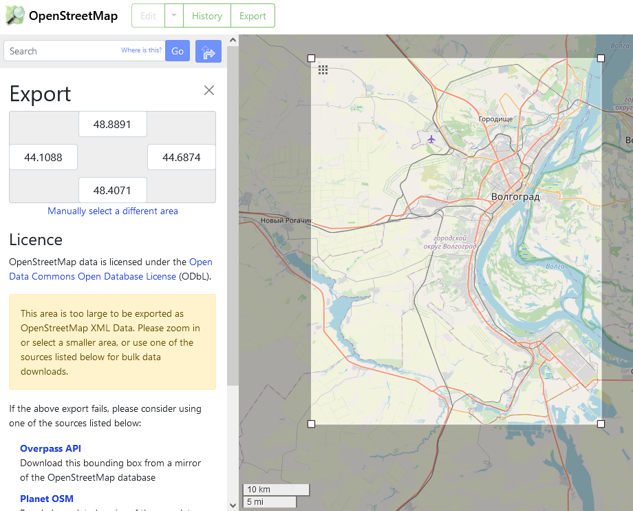

`$prefix` and `$suffix` - provide output format and resource parameters
as well as all required syntax to form a valid
<a href="https://wiki.openstreetmap.org/wiki/Overpass_API/Overpass_QL"
target="_blank">Overpass query</a>.

`$osm_types` - define the elements query needs to pull (see more
<a href="https://wiki.openstreetmap.org/wiki/Elements"
target="_blank">here</a>)

I know, it’s tempting to pull every little detail OSM has to offer,
something like:

`vog_all_data <- osmdata_sf(vog)`

but such a query would take too much time and resources to run, without
saying that resulting dataset would be too large and would eat up most
of your RAM.

Hence, `$features` - help to narrow the query by passing it specific
<a href="https://wiki.openstreetmap.org/wiki/Map_features"
target="_blank">map features</a>. Feature can be specified on a
high-level as a single key (e.g. “amenity” or “building”) or be more
specific as a key-value pair (e.g. “amenity”=“healthcare” or
“building”=“commercial”).

For my minimalist map I would pull all water shapes, roads, and possibly
parks or other vegetation. I don’t want to map full area of the city but
instead will zoom-in closer to the downtown. So here”s updated bounding
box:

``` r
min_lon <- 44.3587
max_lon <- 44.7054
min_lat <- 48.6103
max_lat <- 48.8462

bbox <- c(min_lon,min_lat,max_lon,max_lat)
vog <- opq(bbox = bbox)
```

and now lets pour in some water:

``` r
vog_water <- vog %>% 
  add_osm_feature(key = "natural",
                  value = "water") %>% 
  osmdata_sf()
```

the last line instructs query to treat output as
<a href="https://r-spatial.github.io/sf/articles/sf1.html"
target="_blank">simple features objects</a>

``` r
vog_water
```

    ## Object of class 'osmdata' with:
    ##                  $bbox : 48.6103,44.3587,48.8462,44.7054
    ##         $overpass_call : The call submitted to the overpass API
    ##                  $meta : metadata including timestamp and version numbers
    ##            $osm_points : 'sf' Simple Features Collection with 25942 points
    ##             $osm_lines : 'sf' Simple Features Collection with 52 linestrings
    ##          $osm_polygons : 'sf' Simple Features Collection with 320 polygons
    ##        $osm_multilines : NULL
    ##     $osm_multipolygons : 'sf' Simple Features Collection with 16 multipolygons

As you can see, the resulting object contains multiple dataframes with
geometries: points, lines and polygons (the best explanation I could
find on the difference between a line and multiline or polygon and
multipolygon is <a
href="https://help.arcgis.com/en/geodatabase/10.0/sdk/arcsde/concepts/geometry/shapes/types.htm"
target="_blank">here</a>).

Let’s plot all those shapes to see the difference.

``` r
ggplot() +
  geom_sf(data = vog_water$osm_multipolygons,
          color = NA,
          fill = "steelblue")+
  labs(title = "Multipolygons")+
  coord_sf()+
  theme_void()
```

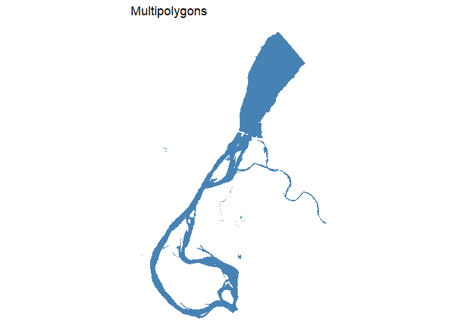<!-- -->

``` r
ggplot() +
  geom_sf(data = vog_water$osm_polygons,
          color = NA,
          fill = "steelblue")+
  labs(title = "Polygons")+
  theme_void()
```

<!-- -->

``` r
ggplot() +
  geom_sf(data = vog_water$osm_lines,
          color = "steelblue")+
  labs(title = "Lines")+
  theme_void()
```

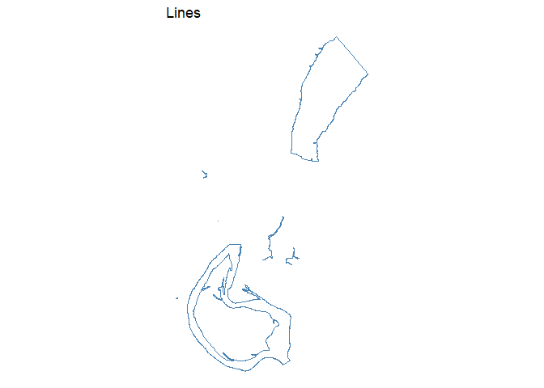<!-- -->

``` r
ggplot() +
  geom_sf(data = vog_water$osm_points,
          color = "steelblue")+
  labs(title = "Points")+
  theme_void()
```

<!-- -->

## Work with geometries

Points and lines are less relevant to mapping the river (at least for my
project) and it seems that multipolygons layer is exactly what I need.
However polygons may have some extra water shapes that are missing on
multipolygon layer. (<a
href="https://cran.r-project.org/web/packages/osmdata/vignettes/osm-sf-translation.html"
target="_blank">here’s the probable reason</a>).

Let’s compare the two dataframes.

``` r
#takes only non-intersecting shapes from polygon layer
poly_diff <- st_difference(vog_water$osm_polygons,vog_water$osm_multipolygons)

ggplot() +
   geom_sf(data = poly_diff,
          fill = "violet",
          color = NA)+
  geom_sf(data = vog_water$osm_multipolygons,
          fill = "steelblue",
          color = NA)+
  theme_void()
```

<!-- -->

As you can see, there are plenty of water shapes missing from
multipolygon layer. However it seems that polygon dataframe includes
islands and islets in addition to water objects.

Let’s take a peek at the `osm_polygons` dataframe once more,

``` r
unique(vog_water$osm_polygons$natural)
```

    ## [1] NA      "water" "sand"

Field `$natural` identifies whether polygon is water or something else,
and it appears that there are not only water shapes. Let’s plot it for a
better visibility:

``` r
ggplot() +
  geom_sf(data = vog_water$osm_polygons,
          aes(fill = natural),
          color = NA)+
  theme_void()
```

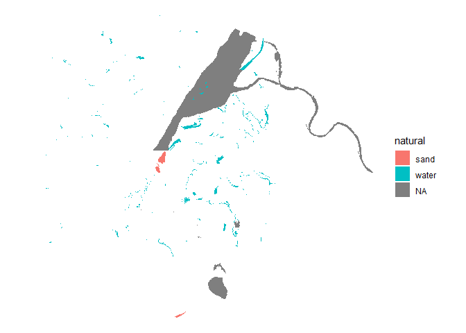<!-- -->

And here’s the “aha” moment. Let’s filter out anything that is not water
and merge the remaining parts with the multipolygon layer:

``` r
vog_water$osm_polygons <- vog_water$osm_polygons %>% 
  filter(natural == "water")

all_vog_water <- st_union(vog_water$osm_polygons,vog_water$osm_multipolygons)

ggplot()+
  geom_sf(data = all_vog_water,
          fill = "steelblue",
          color = NA)+
  theme_void()
```

<!-- -->

Success!

## Pull little more data

Let’s move on to the next feature and load the data for roads:

``` r
vog_roads <- vog %>% 
  add_osm_feature(key = "highway") %>%
  osmdata_sf() 

ggplot() +
  geom_sf(data = vog_roads$osm_lines,
          aes(color=highway))+
  theme_void()
```

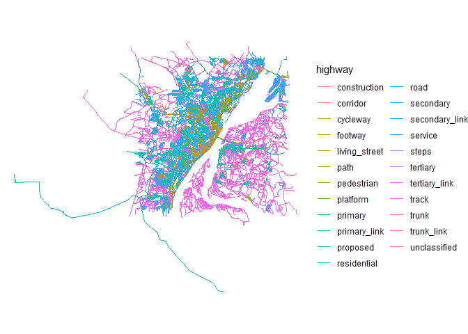<!-- -->

What a beautiful mess. Let’s clean it up and group into 3 buckets:
pedestrian, minor and main roads.

``` r
pedestrian <- vog_roads$osm_lines %>% 
  filter(highway %in% c("footway","track","path")) # unpaved country tracks are technically not pedestrian, but I still included them here, since there were too many of them

minor_road <- vog_roads$osm_lines %>% 
  filter(highway %in% c("residential","tertiary", "secondary", "tertiary_link","secondary_link","primary_link","trunk_link"))

main_roads <- vog_roads$osm_lines %>% 
  filter(highway %in% c("primary","trunk"))

ggplot()+
  geom_sf(data = pedestrian,
          linewidth = .1,
          alpha = .2)+
  geom_sf(data = minor_road,
          linewidth = .5,
          alpha = .7)+
  geom_sf(data = main_roads,
          linewidth = 1)+
  theme_void()
```

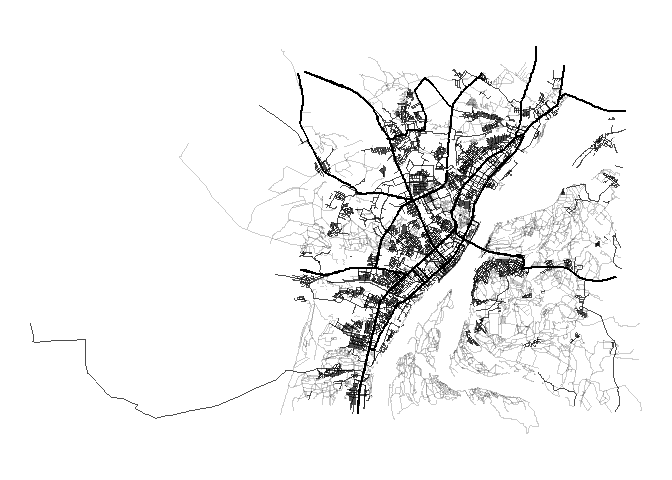<!-- -->

Looks good. Onto the next one. Landscape around Volgograd is mostly
prairies, however there are some woods, including man-made, around the
city. So I got curious to see how many:

``` r
vog_woods <- vog %>% 
  add_osm_feature(key = "natural",
                  value = "wood") %>%
  osmdata_sf() 

vog_woods <- st_union(vog_woods$osm_polygons,vog_woods$osm_multipolygons)

ggplot() +
  geom_sf(data = vog_woods,
          fill = "darkgreen",
          color = NA)+
  theme_void()
```

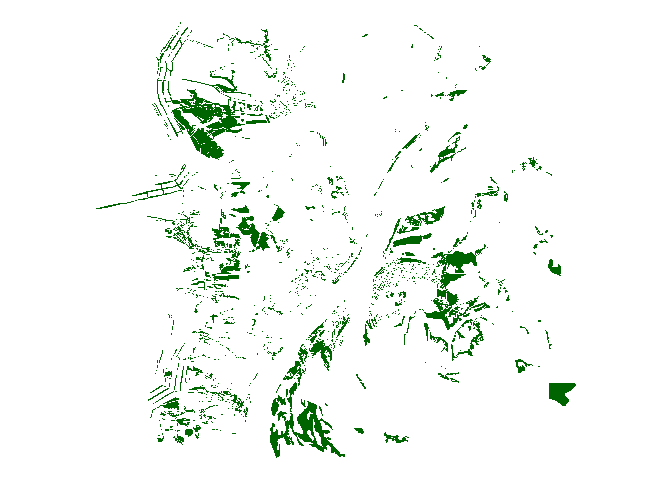<!-- -->

Volgograd suffered greatly during the Second World War and as a result
there are hundreds of memorials, monuments and ruins in the city. The
most famous of these is the giant statue called “The Motherland Calls.”

<figure>

<figcaption aria-hidden="true">War memorial - The Motherland
Calls</figcaption>
</figure>

I wanted to capture that on my map.

``` r
vog_historic <- vog %>% 
  add_osm_feature(key = "historic") %>%
  osmdata_sf() 
```

Finally we have all four layers, Let’s put them together, crop and apply
some fancy colors.

``` r
background_fill <-"#E0D4BE"
woods_fill <-"#78B8A0"
key_color <- "#3B3B3B"
water_fill <- "#B4D9C8"
historic_fill <- "#EB0062"

vog_map <- ggplot()+
  
  #water
  geom_sf(data = all_vog_water,
          fill = water_fill,
          color = NA,
          size = .1)+
  
  #woods
  geom_sf(data = vog_woods,
          fill = woods_fill,
          color = NA)+
  
  #historic
  geom_sf(data = vog_historic$osm_polygons,
          fill = historic_fill,
          color = NA)+
  
  #roads
  geom_sf(data = pedestrian,
          color= key_color,
          linewidth = .1,
          alpha = .2)+
  geom_sf(data = minor_road,
          color = key_color,
          linewidth = .4,
          alpha = .3)+
  geom_sf(data = main_roads,
          color= key_color,
          linewidth = .6,
          alpha = .6)+
  
  #crop the map to the bbox
  coord_sf(xlim = c(min_lon,max_lon),
           ylim = c(min_lat,max_lat),
         expand = FALSE)+
 
  theme_void()+
  
  #add background fill
  theme(panel.background = element_rect(fill = background_fill,
                                       color = key_color))
vog_map
```

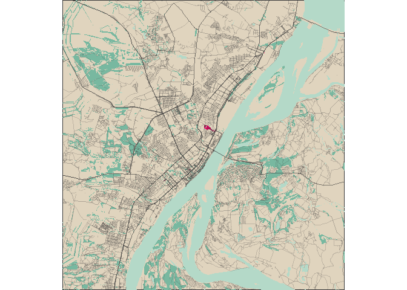<!-- -->

I love how it turned out. Due to the scale the only significant area
where `historic` layer is visible is at “The Motherland Calls” statue,
so I might remove this layer later.

However, it’s not over yet. In the beginning, I used the OSM Export
interface to find the minimum and maximum coordinates for my bounding
box. However, I did not take into account any aspect ratio or specific
size. Since I need to prepare the file for printing, I need to consider
what frame or paper size will be used for this wall art. I decided to
put my print in a 5-by-5-inch frame, so I need it to be perfectly square
(or maybe perfectly circle). This could be a 2-minute job for me in
Photoshop, but the intent was to learn how to do it the hard way (and as
it appears, the right way).

In fact, the principle is similar to masking in a graphics editor. You
need to draw a shape that will then be used as a mask for the map layer.
The easiest way to get a perfectly square bounding box is to wrap it
around a circle. And to draw a circle you just need to know a midpoint
and radius.

## This supposed to be the Chapter 1

To begin with, we need the center coordinates. I have chosen Memorial
Eternal Flame in downtown Volgograd as the midpoint for the mask and a
radius of 10 kilometers (I hope my “imperial” friends will forgive me
this heresy).

``` r
lat <- 48.70842 
lon <- 44.51527
r <- 10000

midpoint <- st_point(c(lon,lat)) %>% 
  st_sfc() %>% 
  st_set_crs(4326) 
```

I found tons of tutorials on how to crop a map to a circle, but none of
them took the time to explain what was actually happening. So here’s
what I managed to find out:

The `st_point()` function constructs a geometry object (point) from the
given list of numbers. The `st_set_crs()` function instructs that the
provided coordinates should be mapped to the EPSG:4326 coordinate
reference system (CRS).

Bloody the hell, does it even mean anything?

Apparently yes, but to make sure I finish this notebook before I turn 60
I will not explain it all here.

Kudos to Justyna Jurkowska and 8th Light for <a
href="https://8thlight.com/insights/geographic-coordinate-systems-101"
target="_blank">the most humane summary</a> of all this Geodetic mess.
So if you are really interested to understand it all - read the above
article or <a href="https://youtu.be/ljZOyxo7QDQ?si=027PWwpbmDVut7xg"
target="_blank">watch this video</a> in case you just want to have fun.
Regardles of your choice, here are few things you need to know:

- A CRS is a system that defines how coordinates on the Earth’s surface
  are represented. There are 2 main types of Coordinate systems:
  projected and geodetic.

- A geodetic coordinate system (GCS) uses a spherical model of the
  Earth. The coordinates are in degrees, and they range from -90 to 90
  for latitude and -180 to 180 for longitude.

- A projected coordinate system (PCS) projects the spherical surface of
  the Earth onto a flat surface. The coordinates are in meters, and they
  are much smaller than the coordinates in GCS.

- The main difference between a GCS and a PCS is that a PCS is designed
  to minimize distortion in a specific area, while a GCS is not. This
  makes PCSs a better choice for mapping small areas, while GCSs are a
  better choice for mapping large areas.

- Behold, there are more than 7600 different PCS available at
  <a href="https://epsg.io/?q=%20kind%3APROJCRS"
  target="_blank">epsg.io</a>) and every of 7600 minimize distortion
  only for a certain area. ( For Example EPSG:2707 - Pulkovo 1995
  projection minimizes distortion along 30 degrees East Meridian and 50
  degrees North Parallel, making it a good choice for plotting Central
  Russia)

How does this relate to our circle? OSMs data model uses EPSG:4326 which
is a spherical model and therefore the only area where distortions will
be minimal are along the equator, but as an object gets closer to the
poles the more distorted it becomes. If we just keep CRS as EPSG:4326
and plot the circle to our map it will appear distorted since Volgograd
is located almost half-way between the equator and the North Pole. To
illustrate that let’s draw a circle from our midpoint using both CRSs:

``` r
midpoint_4326 <- midpoint
midpoint_2707 <- midpoint %>% st_transform(crs=2707)
```

``` r
midpoint_4326
```

    ## Geometry set for 1 feature 
    ## Geometry type: POINT
    ## Dimension:     XY
    ## Bounding box:  xmin: 44.51527 ymin: 48.70842 xmax: 44.51527 ymax: 48.70842
    ## Geodetic CRS:  WGS 84

    ## POINT (44.51527 48.70842)

``` r
midpoint_2707
```

    ## Geometry set for 1 feature 
    ## Geometry type: POINT
    ## Dimension:     XY
    ## Bounding box:  xmin: 464432.1 ymin: 5397405 xmax: 464432.1 ymax: 5397405
    ## Projected CRS: Pulkovo 1995 / 3-degree Gauss-Kruger CM 45E

    ## POINT (464432.1 5397405)

Notice how coordinates transformed from lat/lon into meters.
Function`st_buffer` creates a circle geometry from the set point with
radius equal to `r`

``` r
circle_mask_distorted <-st_buffer(midpoint_4326, dist = r)
circle_mask <- st_buffer(midpoint_2707, dist = r) %>% st_transform(crs=4326)
```

``` r
vog_map+
  
  geom_sf(data = midpoint,
          color = 'red')+
  
  geom_sf(data = circle_mask,
          color = 'blue',
          fill = NA)+
  
  geom_sf(data = circle_mask_distorted,
          color = 'red',
          fill = NA)+

  coord_sf(xlim = c(min_lon,max_lon),
           ylim = c(min_lat,max_lat),
         expand = FALSE)
```

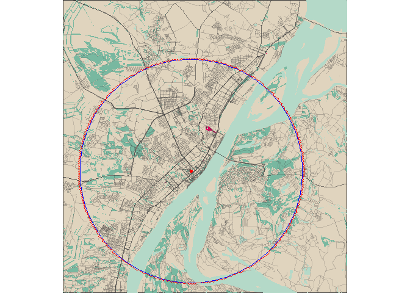<!-- -->

So, map is rendered from EPSG:4326, red circle is the buffer we created
directly in 4326 CSR and blue one was transformed into 2707 and then
projected back in 4326.

Technically, it means that all the shapes I’ve plotted so far are also
somewhat distorted, because they were all mapped relative to EPSG:4326
model. This is not a big deal, really, since this map will never be used
for navigationor any precise calculations. However I still decided to
change all geometries to 2707, just to see how it works.

`st_transforms` function allows to move SF objects to another CRS and
`st_intersection` function returns a geometry that represents the
intersection of 2 input geometries.

``` r
circle_mask <- st_buffer(midpoint_2707, dist = r)
crs <- 2707

water_masked <- all_vog_water %>% 
  st_transform(crs = crs) %>% 
  st_intersection(circle_mask)

historic_masked <- vog_historic$osm_polygons %>% 
  st_transform(crs = crs) %>% 
  st_intersection(circle_mask)

woods_masked <- vog_woods %>%
  st_transform(crs = crs) %>%
  st_intersection(circle_mask)

pedestrian_masked <- pedestrian %>%
  st_transform(crs = crs) %>%
  st_intersection(circle_mask)

minor_road_masked <- minor_road %>%
  st_transform(crs = crs) %>%
  st_intersection(circle_mask)

main_roads_masked <- main_roads %>%
  st_transform(crs = crs) %>%
  st_intersection(circle_mask)
```

All layers are masked and transformed so now we map them again:

``` r
vog_map_circle <- ggplot()+
  
  geom_sf(data = circle_mask,
          fill = background_fill,
          color = key_color)+
 
  #water
  geom_sf(data = water_masked,
          fill = water_fill,
          color = NA
          )+
  
  #woods
  geom_sf(data = woods_masked,
          fill = woods_fill,
          color = NA)+
  

  #historic
  geom_sf(data = historic_masked,
          fill = historic_fill,
          color = NA)+
  
  #roads
  geom_sf(data = pedestrian_masked,
          color= key_color,
          linewidth = .3,
          alpha = .3,
          )+
  
  geom_sf(data = minor_road_masked,
          color = key_color,
          linewidth = .4,
          alpha = .7,
          )+
  
  geom_sf(data = main_roads_masked,
          color= key_color,
          linewidth = 1,
          )+
   
  theme_void()

vog_map_circle
```

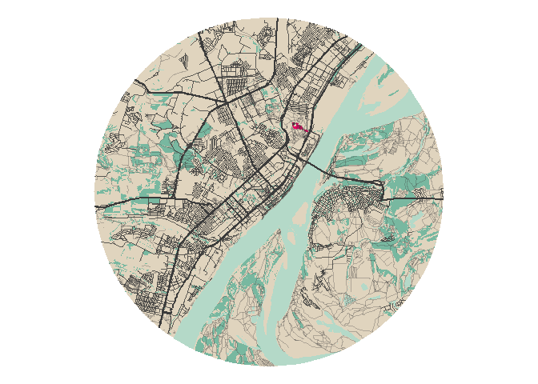<!-- -->

Last piece is to add some text caption, so anyone can see what’s that
place on a map.

## Add title

R is infamous for its font support, so I had to load 2 more libraries to
access
<a href="https://fonts.google.com/" target="_blank">Google fonts</a> and
bring some beauty into my captions.

``` r
library(sysfonts)
library(showtext)
all_fonts <- tibble(font_families_google())
font_add_google("Poiret One", "poiret")  
```

``` r
showtext_auto()
 vog_map_circle+
   
     geom_sf(data = circle_mask,
          fill = NA,
          color = key_color,
          linewidth = 0.8)+
   
   labs(caption = "ВОЛГОГРАД")+

   
    theme(plot.caption = element_text(family = "poiret", 
                                    color = key_color,
                                    size=24, # be sure to change the size before saving
                                    hjust=0.5),
          plot.margin = unit(c(0.5,0.5,0.5,0.5),"in"))
```

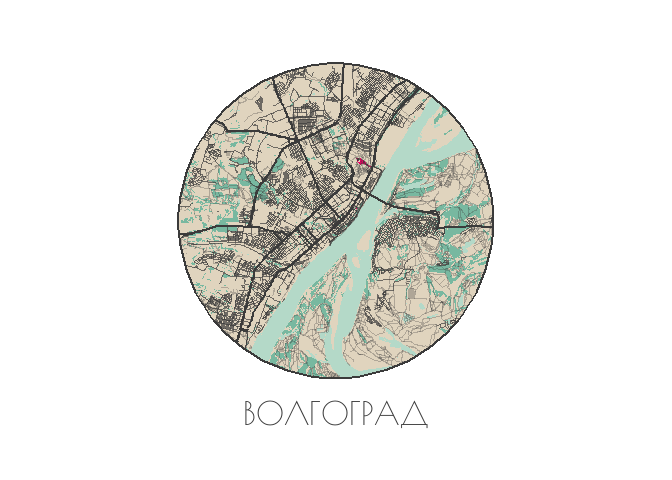<!-- -->

Notice that the font size above was set only to render it correctly in
this notebook. However once you are ready to save your artwork, be sure
to adjust font size to the resolution you are using.

The default screen resolution is 72 dots (points) per inch, which means
if you set your font size to 36 it will take half of an inch on your
screen. To get a sharp image in print you need a much higher resolution
(300 dpi is the standard for print products), so to render your text
correctly you need to adjust it’s size to a roughly 4 times larger.

Final step is to save the image:

``` r
ggsave("volgograd.png", plot = last_plot(),
       scale = 1, width = 1500, height = 1500, units = "px",
       dpi = 300)
```

And we are done!

Last minute I decided I wasn’t happy with the colors so the end result
looks much different, but it actually inspired me to make a map for all
other cities I lived in.

<figure>
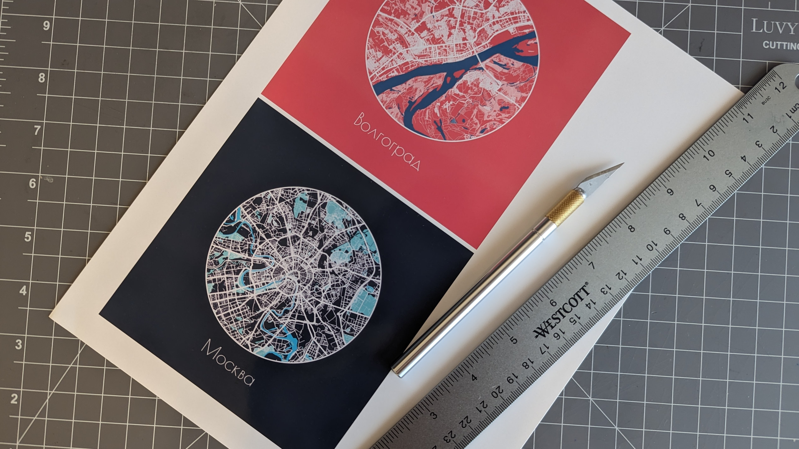
<figcaption aria-hidden="true">Final Result</figcaption>
</figure>

Thanks for reading!
